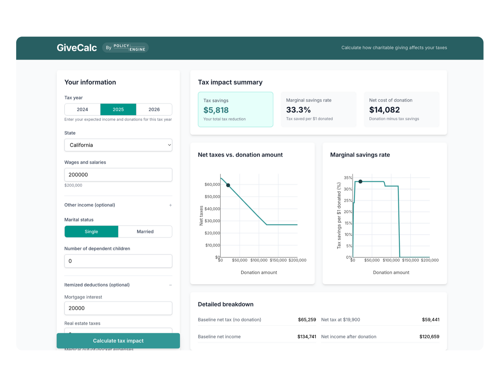
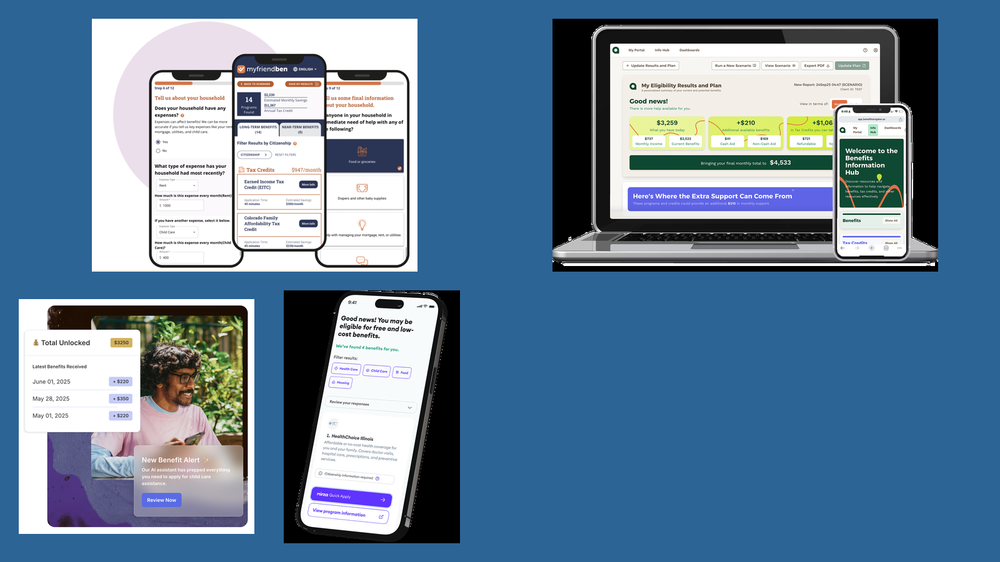

This Giving Tuesday, we're launching [**GiveCalc**](https://givecalc.org) as a standalone web application at [givecalc.org](https://givecalc.org). The free calculator computes how charitable donations affect your federal and state taxes, helping you understand the true cost of giving.

## What's new

Since [launching GiveCalc last year](/us/research/givecalc), we've rebuilt it from the ground up:

- **New domain**: Access GiveCalc directly at [givecalc.org](https://givecalc.org)
- **React frontend**: Faster, more responsive interface
- **2025 tax year support**: Calculate impacts for 2024, 2025, or 2026
- **Expanded income types**: Add self-employment, capital gains, dividends, and interest income
- **Mobile-friendly design**: Use GiveCalc on any device

## How it works

GiveCalc uses PolicyEngine's microsimulation model to compute your taxes with and without donations. Enter your income, filing status, state, and deductions, and GiveCalc shows:

1. **Net tax impact**: How much your donation reduces your tax liability
2. **Marginal giving discount**: The tax savings per additional dollar donated
3. **Target donation finder**: The donation required to achieve a specific net income reduction

For example, a single California filer earning $200,000 with $20,000 in mortgage interest saves $5,818 in taxes on a $19,900 donation — a 33% marginal savings rate that makes their net cost $14,082.

## Supporting PolicyEngine

PolicyEngine builds open-source infrastructure for evidence-based policy analysis. Everything we do is micro-founded: societal impacts are built up person by person, household by household—making policy personal. Our platform serves 40 million calculations annually.

### Policy understanding

[PolicyEngine's calculator](https://policyengine.org/us/household) lets anyone see how taxes and benefits affect their specific situation—and how proposed reforms would change it.

### High-profile policy analysis

When major legislation moves through Congress, we build custom tools to help the public understand impacts. Our [OBBBA household calculator](https://policyengine.github.io/obbba-household-by-household/) lets anyone see how reconciliation bill provisions affect their family.

### Benefit access

Tools like [MyFriendBen](https://myfriendben.org), [Amplifi Benefit Navigator](https://www.benefitnavigator.us), [Starlight](https://www.meetstarlight.com), and [Mirza](https://mirza.co) use PolicyEngine's API to screen families for 40+ federal and state programs they may qualify for, helping close the gap between eligibility and enrollment.

### What donations support

Donations to PolicyEngine are tax-deductible in the US and support:

- **More programs**: Expanding benefit coverage so screening tools can help more families
- **Better data**: Improving accuracy for poverty and distributional analysis
- **Open infrastructure**: Sustaining free access for researchers, governments, and the public

See how we spend donations on [Open Collective](https://opencollective.com/policyengine).

[Donate to PolicyEngine](https://policyengine.org/us/donate) and use [GiveCalc](https://givecalc.org) to calculate your tax savings.

## Try GiveCalc

Visit [givecalc.org](https://givecalc.org) to calculate how your charitable giving affects your taxes. The [source code](https://github.com/PolicyEngine/givecalc) is open source, and we welcome [contributions and feedback](https://github.com/PolicyEngine/givecalc/issues).
